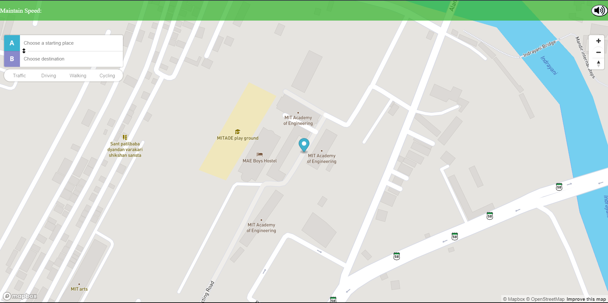
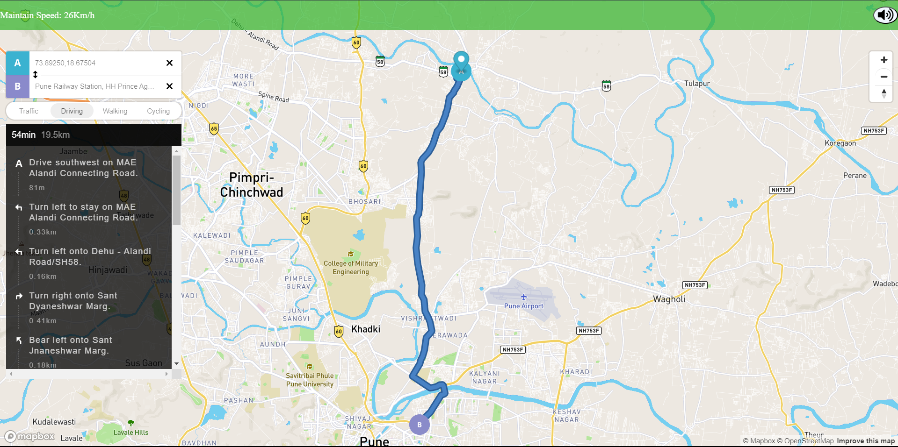
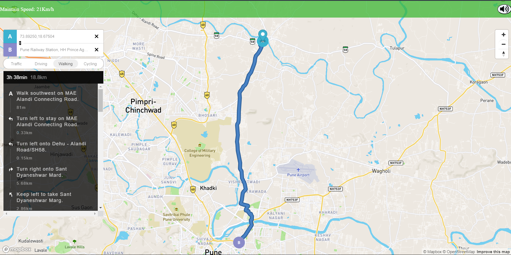

# CitySpeed Advisor

CitySpeed Advisor is a real-time vehicle speed control system that utilizes traffic signal information to improve traffic flow and reduce wait time for drivers. This project aims to enhance road safety, increase traffic management efficiency, and improve the overall driver experience in a smart city environment.

## Features

- Real-time information on traffic signal positions and their current status.
- Advises drivers on the optimal speed to avoid stopping at red lights.
- Improved road safety by reducing instances of drivers running red lights.
- Increased efficiency in traffic management and reduced congestion in cities.
- Enhanced driver experience in a smart city environment.

## Project Goals

The primary goals of the CitySpeed Advisor project are:

1. **Efficient Transportation:** To improve the efficiency of the transportation system in a smart city by providing drivers with real-time information about traffic signal positions and their current status.

2. **Reduced Wait Times:** To reduce wait time at traffic signals by advising drivers on the optimal speed to avoid stopping at red lights.

## Technologies Used

- Python Flask: Used for the backend logic and web server.
- Mapbox: Used for mapping and location-based services.

## Deployment

CitySpeed Advisor is hosted with the help of PythonAnywhere and can be accessed at [http://trafficmap.akarshsharat.com/](http://trafficmap.akarshsharat.com/).

## Usage

- Visit [http://trafficmap.akarshsharat.com/](http://trafficmap.akarshsharat.com/) to access the CitySpeed Advisor application.
- Enter your current location or allow the application to access your location.
- Receive real-time traffic signal information and speed recommendations to optimize your journey.

##Output

_Contributions to this project are welcome_
